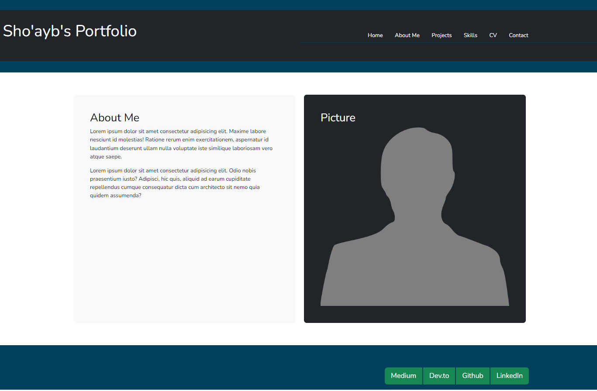

# TABLE OF CONTENTS

[Project Title](#project-title)
[Description](#description)
[Installation](#installation)
[Usage](#usage)
[Guidelines](#guidelines)
[Testing the Application](#testing-the-application)
[Image of react portfolio](#image-of-react-portfolio)
[Github](#github)
[Contact Us](#contact-us)
[Licence](#licence)

## Project Title

React-Profile

## Description

A Bootstrap portfolio built using React.

## Installation

Portfolio opens in web browser, no installation is required.

## Usage

Open the website in any web browser of your choice and navigate the webpages using the links on the navigation links.

## Guidelines

There is no contribution neccessary for this website.

## Testing the Application

No testing is required.

## Image of React Portfolio

;

## Github

[Link to Github]("https://github.com/Sho-ayb/react-profile")

## Deployed Live

[Deployed on Github]("https://sho-ayb.github.io/react-profile/")

## Questions

Please contact through Github if you have any questions. Thanks.

## Licence

MIT License

Please click on the badge for more details on the licence.

